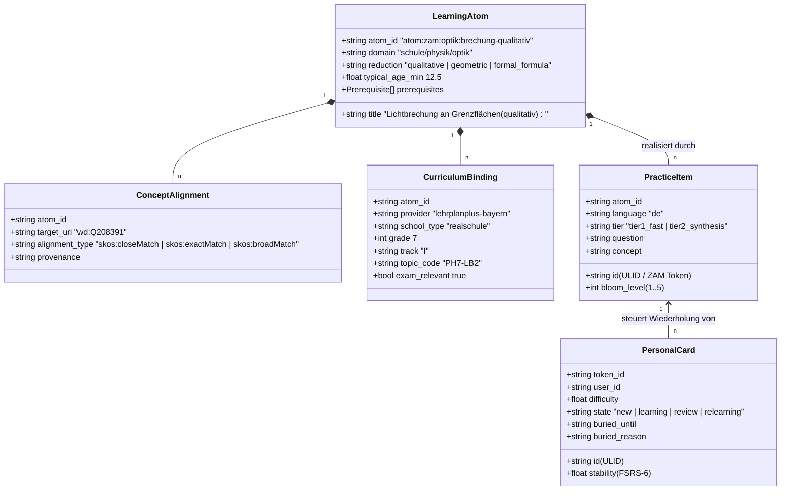

# Draft-Architektur: Zentrale Wissensbasis als weltweiter Bildungs-Graph („Google Maps für das Lernen“)

**Status:** Draft / Proposal (Konsolidiert nach 4 Agenten-Reviews und Owner-Entscheidungsrunde vom 2026-08-14)  
**Datum:** 2026-08-14  
**Autoren:** ZAM Core & Agent Research Team (Gemini, Grok, Codex, Claude Opus, Thomas)  
**Bezug zu bestehenden ADRs:**
- [ADR 2026-08-14: Published Learning Atom Identity, 5-Object Model, and SKOS Alignments](../adr/2026-08-14-central-learning-atoms-and-identity.md)
- [ADR 2026-07-26b: Central Curriculum Content Service: Content Only, Pulled Forward](../adr/2026-07-26b-central-curriculum-content-service.md)
- [ADR 2026-07-25: Shared Curated Learning Content — Review Once, Serve Many](../adr/2026-07-25-shared-curated-learning-content.md)
- [ADR 2026-07-04: Closed-Group Learning Library: Curation, Privacy and Deployment](../adr/2026-07-04-multi-learner-shared-knowledge.md)
- [ADR 2026-07-02: LehrplanPLUS Curriculum Import Wizard](../adr/2026-07-02-lehrplanplus-import-wizard.md)

---

## 1. Executive Summary & Leitprinzipien

### 1.1 Die Vision
Ziel dieses Systems ist der Aufbau einer **offenen, zentralen, versionsgeführten Wissensbasis**, die den gesamten Lernpfad eines heranwachsenden Menschen von der frühen Kindheit bis zum Schulabschluss (und darüber hinaus) als **gerichteten Abhängigkeitsgraphen (Prerequisite-DAG)** abbildet.

Jeder Knoten repräsentiert eine atomare Lerneinheit, versehen mit:
1. **Didaktischen Altersempfehlungen** (typisches Mindestalter als Orientierung, **kein hartes Gate**),
2. **Curricularen Overlays** (z. B. *Realschule Bayern – Physik 7 (Zweig I) bzw. Physik 8 (Zweig II/III)*),
3. **Multimodalen Erklärungsressourcen** (kuratierte YouTube-Videoanker mit Timestamps, interaktive HTML5/PhET-Simulationen, Audio-Erklärungen, Bilddiagramme),
4. **2-Stufen-Interaktionsmustern** (Tier 1: Schnelle, reibungslose Micro-Checks für den sofortigen Abrufeffekt; Tier 2: Vertiefende Synthese und Transferaufgaben).

### 1.2 Das Paradigma: „Google Maps für das Wissen“
Kartendienste wie Google Maps oder OpenStreetMap skalieren für Milliarden Menschen bei minimalen Kosten, weil sie:
- Daten nicht pro Nutzer dynamisch auf zentralen Servern berechnen,
- sondern **vorberechnete, unveränderliche Vektorkacheln (Vector Tiles)** über globale CDNs ausliefern,
- während Rendering, Routenfindung und Fortschrittsverfolgung **vollständig auf dem Endgerät (Edge/Client)** stattfinden.

Die zentrale ZAM-Wissensbasis adaptiert genau dieses Prinzip als **Knowledge Vector Tiles (KVT)**:
- **Zentraler Betreiber:** Pflegt und verteilt statische, kompilierte Graph-Kacheln über CDNs.
- **Client (ZAM App):** Lädt den benötigten Sub-Graphen für den gewählten Bildungspfad herunter und führt Graph-Traversierung, FSRS-6-Scheduling und Knowledge Tracing lokal in einer In-Memory- oder SQLite-Engine aus.
- **Kosten:** Der laufende Betrieb ist reine CDN-Bandbreite statt Cluster — der teure Posten ist Curation, nicht Infrastruktur. Konkrete Eurobeträge gehören in einen messbaren Betriebsplan, nicht in die Architekturentscheidung.
- **Datenschutz:** Der Content-Dienst führt strukturell keine personenbezogenen Daten. Das ist eine starke Aussage über *diese Schicht* — nicht „100 % DSGVO“: der Client verarbeitet Minderjährigendaten, und externe Medienaufrufe können Metadaten an Dritte senden.
- **Offline:** vollständig, sobald eine Zelle geladen ist.

---

## 2. System-Topologie & Datentrennung

Die Architektur erzwingt eine strikte physische und logische Trennung der Datenklassen gemäß [ADR 2026-07-26b](../adr/2026-07-26b-central-curriculum-content-service.md):

```
┌──────────────────────────────────────────────────────────────────────────────────────────┐
│                      1. ZENTRALER KNOWLEDGE-LAYER (Öffentlich, Read-Only, CDN)            │
├──────────────────────────────────────────────────────────────────────────────────────────┤
│ • Canonical Learning Atoms (Opaque Atom-ID, Titel, Reduktionsstufe, Mindestalter)        │
│ • Typisierte SKOS-Alignments (z. B. wd:Q208391 für Snell's Law via skos:closeMatch)      │
│ • Prerequisite-Kanten (Strikte Abhängigkeiten & weiche Empfehlungen)                     │
│ • Lehrplan-Taxonomien (LehrplanPLUS Bayern, KMK, etc. mit Prüfungsrelevanz-Flags)        │
│ • Übungsitems / Practice Items (Tier 1 Fast Checks, Tier 2 Synthese-Fragen)              │
│ • Multimodale Ressourcen (YouTube Timestamps, PhET, GeoGebra, Audio, Bilder)             │
│ • Lehrer-/Experten-Signaturen & Revisionsgeschichte (Git-basiert)                        │
└────────────────────────────────────────────┬─────────────────────────────────────────────┘
                                             │ Statischer Kachel-Download (HTTP GET)
                                             ▼
┌──────────────────────────────────────────────────────────────────────────────────────────┐
│                     2. LERNER-EDGE (100% Lokal, Privat, DSGVO-sicher)                    │
├──────────────────────────────────────────────────────────────────────────────────────────┤
│ • FSRS-6 Lernkarten (Stabilität, Schwierigkeit, Abrufhistorie, Reps, Lapses)             │
│ • Queue-Steuerung via `cards.buried_until` (Selbsteinschätzung schiebt Vorbedingungen)   │
│ • Gescannte Schulhefte & Arbeitsblätter (Lokale Vision-OCR & Embedding-Matching)         │
│ • Persönliche Eselsbrücken, Freitext-Notizen & Sprachaufnahmen                           │
│ • Gewählter Bildungspfad (z. B. "Realschule Bayern, 7. Klasse, Zweig I")                 │
└──────────────────────────────────────────────────────────────────────────────────────────┘
```

---

## 3. Das 5-Objekte-Datenmodell

Zur sauberen Entkopplung von universellem Wissen, amtlichen Lehrplänen und konkreten Abrufaufgaben implementiert ZAM das **5-Objekte-Modell**:



---

## 4. Vollständig geerdetes Referenzbeispiel (Optik Realschule Bayern)

Verankert an den Primärquellen des ISB Bayern ([Fachlehrplan Physik 7 Realschule I, Lernbereich 65643](https://www.lehrplanplus.bayern.de/fachlehrplan/lernbereich/65643) und [Physik 8 Realschule II/III](https://www.lehrplanplus.bayern.de/fachlehrplan/realschule/8/physik/wpfg2-3)):

### 4.1 Kanonisches Lernziel-Atom (`learning_atoms.jsonld`)
```json
{
  "$schema": "https://zam.app/schemas/v1/learning-atom.json",
  "id": "atom:zam:optik:brechung-qualitativ",
  "title": "Lichtbrechung an Grenzflächen (qualitativ)",
  "domain": "schule/physik/optik",
  "reduction": "qualitative",
  "typical_age_min": 12.5,
  "prerequisites": [
    {
      "atom_id": "atom:zam:optik:strahlengang-lot",
      "type": "hard",
      "rationale": "Das Konzept des Einfallslots und des Einfallswinkels ist Voraussetzung für die Beschreibung der Richtungsänderung."
    }
  ],
  "alignments": [
    {
      "target_uri": "http://www.wikidata.org/entity/Q11334",
      "target_label": "Refraction",
      "alignment_type": "skos:broadMatch",
      "provenance": "manual_curation_v1"
    },
    {
      "target_uri": "http://www.wikidata.org/entity/Q208391",
      "target_label": "Snell's law",
      "alignment_type": "skos:closeMatch",
      "provenance": "manual_curation_v1"
    }
  ],
  "curricula": [
    {
      "provider": "lehrplanplus-bayern",
      "school_type": "realschule",
      "grade": 7,
      "track": "I",
      "subject": "physik",
      "topic_code": "PH7-LB2",
      "topic_title": "Ausbreitung und Brechung des Lichts",
      "exam_relevant": true
    },
    {
      "provider": "lehrplanplus-bayern",
      "school_type": "realschule",
      "grade": 8,
      "track": "II_III",
      "subject": "physik",
      "topic_code": "PH8-LB2",
      "topic_title": "Licht und Schatten, Reflexion und Brechung",
      "exam_relevant": true
    }
  ],
  "learning_media": [
    {
      "id": "media-sim-phet-01",
      "type": "interactive_simulation",
      "provider": "phet",
      "uri": "https://phet.colorado.edu/sims/html/bending-light/latest/bending-light_all.html",
      "title": "Lichtbrechung Experimentierlabor"
    }
  ]
}
```

### 4.2 Zugehörige Übungsitems / Practice Items
```json
[
  {
    "id": "01K3X9A7R4B8C1D2E3F4G5H601",
    "atom_id": "atom:zam:optik:brechung-qualitativ",
    "language": "de",
    "bloom_level": 2,
    "tier": "tier1_fast",
    "question": "In welche Richtung knickt ein Lichtstrahl beim Übergang von Luft in Wasser?",
    "concept": "Zum Einfallslot hin, da Wasser optisch dichter ist als Luft.",
    "fast_check": {
      "type": "binary_choice",
      "options": ["Zum Lot hin", "Vom Lot weg"],
      "correct_index": 0
    }
  },
  {
    "id": "01K3X9A7R4B8C1D2E3F4G5H602",
    "atom_id": "atom:zam:optik:brechung-qualitativ",
    "language": "de",
    "bloom_level": 3,
    "tier": "tier2_synthesis",
    "question": "Warum erscheint ein gerader Stab, der schräg in ein Wasserglas gehalten wird, an der Wasseroberfläche geknickt?",
    "concept": "Lichtstrahlen vom Stab werden beim Übergang aus dem Wasser (optisch dichter) in die Luft (optisch dünner) vom Lot weg gebrochen. Das Auge verlängert die Strahlen geradlinig zurück, wodurch das Bild des Stabs nach oben verschoben und geknickt erscheint."
  }
]
```

---

## 5. Das Einstiegsproblem & Lernerverhalten (Owner-Entscheidungen)

### 5.1 Das Gate steht auf AUS (Reaktive Terminierung)
Betritt ein Lerner den Graphen in Klasse 9, wird er **nicht** durch Vorab-Tests blockiert:
1. **Kein hartes Gate:** Unerfüllte Voraussetzungen versperren das Ziel-Token nicht.
2. **Selbsteinschätzung auf Voraussetzungen:** Beim ersten Kontakt mit einem Ziel-Token kann der Lerner seine Vorkenntnisse zu den direkten Voraussetzungen kurz einschätzen (*„Kann ich schon“* / *„Muss ich wiederholen“*).
3. **Terminierung via `cards.buried_until`:** 
   - Die Selbsteinschätzung setzt **ausschließlich** `cards.buried_until` (z. B. auf 30 Tage in die Zukunft).
   - Die Karte bleibt im FSRS-Status `new` mit `stability=0.0`, `reps=0`. Der FSRS-Algorithmus startet erst beim ersten echten Abruf völlig unverfälscht.
4. **Leere Queue-Regel:** Läuft die Lernqueue leer und der Lerner möchte weiterlernen, dürfen vergrabene (`buried`) Karten vorgezogen werden.

### 5.2 Fehler-Diagnose: Fundament fehlt vs. Anwendungsfehler

> **Stellschraube, noch nicht gebaut** (ADR 2026-08-14, Abschnitt 4). Default
> ist und bleibt `cascadeBlock`, bis die Feldmessung zeigt, dass „Fundament
> intakt, Anwendung misslungen“ häufig ist.

Denkbarer Ablauf, wenn ein Schüler an einer Tier-2-Aufgabe scheitert (Bewertung `Again / 1`):
1. Das System blockiert die Karte nicht blind via `cascadeBlock`.
2. Stattdessen wird im nächsten Schritt ein **einzelner 1-Tap Tier-1-Check** der direkten Voraussetzung eingestreut.
3. **Reaktion:**
   - *Tier-1-Check bestanden:* Fundament sitzt! Das Problem lag nur in der komplexen Anwendung $\rightarrow$ Voraussetzung bleibt vergraben, Zielkarte wird wie gewohnt wiederholt.
   - *Tier-1-Check nicht bestanden:* Fundament wackelt! $\rightarrow$ Voraussetzung wird aktiv in die Lernqueue geholt.

---

## 6. Knowledge Vector Tiles (KVT): Skalierung & Verteilung

### 6.1 Partitionierungsstrategie
- **Curriculum-Kacheln (`/tiles/curricula/{country}-{region}/{school-type}-{grade}-{subject}.jsonld`)**:
  - Kompakte Kacheln (~100–250 KB) mit den Atomen, Übungsitems und Overlays für ein Schuljahr und Fach.
- **Topologische Domain-Kacheln (`/tiles/domains/{domain-root}.jsonld`)**:
  - Vollständiger Fach-Graph für universelle Quervernetzungen.

### 6.2 Verteilung & Kosten
- **Hosting:** Statischer Objektspeicher (Cloudflare R2 / S3) + CDN.
- **Kosten:** Nahezu 0 € Betriebskosten, extrem hohe Cache-Hit-Ratio, unbegrenzte Skalierung für Millionen von Schülern.
