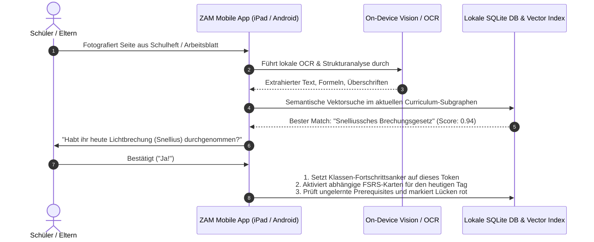

# Draft-Architektur: Zentrale Wissensbasis als weltweiter Bildungs-Graph („Google Maps für das Lernen“)

**Status:** Draft / Proposal  
**Datum:** 2026-08-14  
**Autoren:** ZAM Core & Agent Research Team  
**Bezug zu bestehenden ADRs:**
- [ADR 2026-07-26b: Central Curriculum Content Service: Content Only, Pulled Forward](../adr/2026-07-26b-central-curriculum-content-service.md)
- [ADR 2026-07-25: Shared Curated Learning Content — Review Once, Serve Many](../adr/2026-07-25-shared-curated-learning-content.md)
- [ADR 2026-07-04: Closed-Group Learning Library: Curation, Privacy and Deployment](../adr/2026-07-04-multi-learner-shared-knowledge.md)
- [ADR 2026-07-02: LehrplanPLUS Curriculum Import Wizard](../adr/2026-07-02-lehrplanplus-import-wizard.md)

---

## 1. Executive Summary & Leitprinzipien

### 1.1 Die Vision
Ziel dieses Systems ist der Aufbau einer **offenen, zentralen, versionsgeführten Wissensbasis**, die den gesamten Lernpfad eines heranwachsenden Menschen von der frühen Kindheit bis zum Schulabschluss (und darüber hinaus) als **gerichteten Abhängigkeitsgraphen (Prerequisite-DAG)** abbildet.

Jeder Knoten (Knowledge Token) repräsentiert eine atomare Lerneinheit, versehen mit:
1. **Didaktischen Alterstags** (Entwicklungsstufe / typisches Mindestalter für das Verstehen),
2. **Curricularen Overlays** (z. B. *Realschule Bayern – 9. Klasse – naturwissenschaftlicher Zweig*),
3. **Multimodalen Erklärungsressourcen** (kuratierte YouTube-Videoanker mit Timestamps, interaktive HTML5/PhET-Simulationen, Audio-Erklärungen, Bilddiagramme),
4. **2-Stufen-Interaktionsmustern** (Tier 1: Schnelle, reibungslose Micro-Checks für den sofortigen Abrufeffekt; Tier 2: Vertiefende Synthese und Prüfungsaufgaben für spätere Meisterungsprüfungen).

### 1.2 Das Paradigma: „Google Maps für das Wissen“
Kartendienste wie Google Maps oder OpenStreetMap skalieren für Milliarden Menschen bei minimalen Kosten, weil sie:
- Daten nicht pro Nutzer dynamisch auf zentralen Servern berechnen,
- sondern **vorberechnete, unveränderliche Vektorkacheln (Vector Tiles)** über globale CDNs ausliefern,
- während Rendering, Routing und Routenverfolgung **vollständig auf dem Endgerät (Edge/Client)** stattfinden.

Die zentrale ZAM-Wissensbasis adaptiert genau dieses Prinzip als **Knowledge Vector Tiles (KVT)**:
- **Zentraler Betreiber:** Pflegt und verteilt statische, kompilierte Graph-Kacheln über CDNs.
- **Client (ZAM App):** Lädt den benötigten Sub-Graphen für den gewählten Bildungspfad herunter und führt Graph-Traversierung, FSRS-Scheduling und Knowledge Tracing lokal in einer In-Memory- oder SQLite-WASM-Engine aus.
- **Kosten:** Nahezu **0 € Serverkosten** im laufenden Betrieb, 100% DSGVO-konform, vollständige Offline-Fähigkeit.

---

## 2. System-Topologie & Datentrennung

Die Architektur erzwingt eine strikte physische und logische Trennung der Datenklassen gemäß [ADR 2026-07-26b](../adr/2026-07-26b-central-curriculum-content-service.md):

```
┌──────────────────────────────────────────────────────────────────────────────────────────┐
│                      1. ZENTRALER KNOWLEDGE-LAYER (Öffentlich, Read-Only, CDN)            │
├──────────────────────────────────────────────────────────────────────────────────────────┤
│ • Canonical Tokens (Titel, Konzept, Frage, Bloom-Level, Typisches Mindestalter)          │
│ • Prerequisite-Kanten (Strikte Abhängigkeiten & weiche Empfehlungen)                     │
│ • Lehrplan-Taxonomien (LehrplanPLUS Bayern, KMK, etc. mit Prüfungsrelevanz-Flags)        │
│ • Multimodale Ressourcen (YouTube Timestamps, PhET, GeoGebra, Audio, Bilder)             │
│ • Lehrer-/Experten-Signaturen & Revisionsgeschichte (Git-basiert)                        │
└────────────────────────────────────────────┬─────────────────────────────────────────────┘
                                             │ Statischer Kachel-Download (HTTP Range / GET)
                                             ▼
┌──────────────────────────────────────────────────────────────────────────────────────────┐
│                     2. KLASSEN- & SCHUL-LAYER (Optional / Halboffen / Sync)              │
├──────────────────────────────────────────────────────────────────────────────────────────┤
│ • Klassen-Fortschrittszeiger (Aktuelles Thema der Woche im Schuljahr)                    │
│ • Aggregierte Hausaufgaben- & Stoff-Empfehlungen der Lehrkraft                           │
└────────────────────────────────────────────┬─────────────────────────────────────────────┘
                                             │
                                             ▼
┌──────────────────────────────────────────────────────────────────────────────────────────┐
│                     3. LERNER-EDGE (100% Lokal, Privat, DSGVO-sicher)                    │
├──────────────────────────────────────────────────────────────────────────────────────────┤
│ • FSRS-5 Lernkarten (Stabilität, Schwierigkeit, Abrufhistorie, Reps, Lapses)             │
│ • Knowledge Tracing Vektor (Individueller Mastery-Score pro Graph-Knoten)                │
│ • Gescannte Schulhefte & Arbeitsblätter (Lokale Vision-OCR & Embedding-Matching)         │
│ • Persönliche Eselsbrücken, Freitext-Notizen & Sprachaufnahmen                           │
│ • Gewählter Bildungspfad (z. B. "Realschule Bayern, 9. Klasse, Zweig I")                 │
└──────────────────────────────────────────────────────────────────────────────────────────┘
```

---

## 3. Datenmodell & Schema-Spezifikation

### 3.1 Kanonisches Knowledge-Token Schema (JSON-LD / JSON-Schema v1)

```json
{
  "$schema": "https://zam.app/schemas/v1/knowledge-token.json",
  "id": "01K3X9A7R4B8C1D2E3F4G5H6J7",
  "slug": "physik-optik-brechungsgesetz-snellius",
  "title": "Snelliussches Brechungsgesetz",
  "wikidata_id": "Q202814",
  "concept": "Beim Übergang von Licht zwischen zwei Medien mit Brechungsindizes n1 und n2 gilt das Brechungsgesetz: n1 * sin(alpha) = n2 * sin(beta).",
  "domain": "schule/physik/optik",
  "bloom_level": 3,
  "age_recommendation": {
    "typical_age_min": 14.0,
    "developmental_stage": "formal_operational",
    "rationale": "Erfordert Verständnis von Winkelfunktionen (Sinus) und proportionalen Verhältnissen."
  },
  "prerequisites": [
    {
      "token_id": "physik-optik-lichtausbreitung-strahlengang",
      "type": "hard",
      "rationale": "Ohne das Konzept des Lichtstrahls und des Einfallswinkels ist die Brechung nicht definierbar."
    },
    {
      "token_id": "mathematik-geometrie-sinus-funktion",
      "type": "hard",
      "rationale": "Mathematische Berechnung der Winkelverhältnisse."
    },
    {
      "token_id": "physik-wellenlehre-phasengeschwindigkeit",
      "type": "soft",
      "rationale": "Erklärt die physikalische Ursache der Brechung über Wellenfronten (Huygens-Prinzip)."
    }
  ],
  "curricula": [
    {
      "provider": "lehrplanplus-bayern",
      "country": "DE",
      "region": "BY",
      "school_type": "realschule",
      "grade": 9,
      "track": "naturwissenschaftlich",
      "subject": "physik",
      "topic_code": "PH9-LB2",
      "topic_title": "Optik und Lichtbrechung",
      "exam_relevant": true
    },
    {
      "provider": "bildungsplan-bw",
      "country": "DE",
      "region": "BW",
      "school_type": "gymnasium",
      "grade": 8,
      "subject": "physik",
      "exam_relevant": true
    }
  ],
  "learning_media": [
    {
      "id": "media-yt-01",
      "type": "video",
      "provider": "youtube",
      "uri": "https://www.youtube.com/watch?v=sample-video-id",
      "start_sec": 42,
      "end_sec": 165,
      "language": "de",
      "title": "Brechung von Licht anschaulich im Experiment",
      "author": "Lehrer Schmidt / SimpleClub"
    },
    {
      "id": "media-sim-01",
      "type": "interactive_simulation",
      "provider": "phet",
      "uri": "https://phet.colorado.edu/sims/html/bending-light/latest/bending-light_all.html",
      "title": "Lichtbrechung interaktives Labor (PhET)",
      "embedded_allowed": true
    },
    {
      "id": "media-img-01",
      "type": "infographic",
      "uri": "assets/diagrams/optik-snellius-strahlengang.svg",
      "alt_text": "Darstellung des Einfallswinkels alpha und Brechungswinkels beta zum Lot."
    }
  ],
  "interactions": {
    "tier1_fast_checks": [
      {
        "id": "fc-01",
        "type": "binary_choice",
        "prompt": "Wird ein Lichtstrahl beim Übergang von Luft in Glas zum Lot hin oder vom Lot weg gebrochen?",
        "options": ["Zum Lot hin", "Vom Lot weg"],
        "correct_index": 0,
        "explanation": "Glas ist optisch dichter als Luft (n2 > n1), daher verkleinert sich der Winkel zum Lot."
      },
      {
        "id": "fc-02",
        "type": "cloze_tap",
        "prompt": "Vervollständige die Formel: n1 * [gap1] = n2 * [gap2]",
        "gaps": [
          { "id": "gap1", "correct": "sin(α)", "distractors": ["cos(α)", "tan(α)", "α²"] },
          { "id": "gap2", "correct": "sin(β)", "distractors": ["cos(β)", "tan(β)", "1/β"] }
        ]
      }
    ],
    "tier2_synthesis": {
      "prompt": "Ein Taucher leuchtet mit einer Taschenlampe unter Wasser schräg nach oben an die Wasseroberfläche. Erkläre, was ab einem bestimmten Winkel passiert und wie man dieses Phänomen nennt.",
      "expected_key_concepts": [
        "Totalreflexion",
        "Grenzwinkel",
        "Übergang von optisch dichter zu optisch dünner",
        "Keine Brechung mehr ins Freie"
      ],
      "sample_solution": "Ab dem Grenzwinkel der Totalreflexion wird das Licht vollständig an der Grenzfläche reflektiert und tritt nicht mehr in die Luft über."
    }
  },
  "curation": {
    "published_version": 1,
    "verified_by": "fachschaft-physik-bayern",
    "verified_at": "2026-08-14T12:00:00Z",
    "signature": "ed25519:3b9f...a8c1"
  }
}
```

---

## 4. Knowledge Vector Tiles (KVT): Skalierung & Verteilung

### 4.1 Partitionierungsstrategie
Der globale Graph wird nicht als monolithische Datenbank ausgeliefert, sondern in **Kacheln (Tiles)** zerschnitten:

1. **Curriculum-Kacheln (`/tiles/curricula/{country}-{region}/{school-type}-{grade}-{subject}.jsonld`)**:
   - Enthält die Zuordnungen, Reihenfolgen und Prüfungsrelevanz-Flags für ein konkretes Fach und Schuljahr (z. B. `de-by/realschule-9-physik.jsonld`, ~120 KB).
2. **Topologische Domain-Kacheln (`/tiles/domains/{domain-root}.sqlite`)**:
   - Enthält den universellen Wissensgraphen eines Großbereichs (z. B. `mathematik.sqlite`, `physik.sqlite`, jeweils ~1–3 MB).
   - Enthält alle Knoten, Relationen, Einbettungsvektoren und Tier-1-Checks.
3. **Media-Manifest-Kacheln (`/tiles/media/{domain-root}.json`)**:
   - URLs, Timecodes und Metadaten zu externen Videos und Simulationen.

### 4.2 Verteilungs- und Caching-Modell
- **Hosting:** Statische Dateien auf Objektspeicher (z. B. Cloudflare R2, AWS S3, BunnyCDN, GitHub Pages).
- **Caching:** `Cache-Control: public, max-age=31536000, immutable` mit Content-Hash-Versionierung in URLs (`/v2026.08/tiles/...`).
- **Client-Download:** 
  - Beim Einrichten eines Schülerprofils (z. B. Realschule Bayern 9. Klasse) lädt der ZAM-Client im Hintergrund 5–10 Kacheln (Gesamtvolumen: ~15 MB).
  - Bei Änderungen wird über einen leichten Index (`index.json` mit Hash-Tabelle) differentiell synchronisiert.

---

## 5. Curation- & Audit-Pipeline für Lehrkräfte

Damit Inhalte nicht durch halluzinierende LLMs verunreinigt werden, gilt das ZAM-Prinzip: **„AI generiert Entwürfe – Lehrkräfte prüfen und signieren – Millionen Lerner profitieren.“**

```mermaid
flowchart TD
    A[Offizielle Lehrplan-Texte / Schulbücher] --> B[ZAM Ingestion Pipeline (Draft Generator)]
    B --> C[Draft Token Pool in ZAM Studio]
    C --> D{Lehrer-/Fachschafts-Review}
    D -->|Korrektur nötig| C
    D -->|Freigegeben| E[Git Pull Request / Curation Repo]
    E --> F[CI/CD Validierung]
    F --> F1[1. Zyklenfreiheit des DAG prüfen]
    F --> F2[2. Bloom- & Alters-Konsistenz prüfen]
    F --> F3[3. Medien-Links auf Erreichbarkeit testen]
    F --> G[Build: Knowledge Vector Tiles kompilieren]
    G --> H[Signierung mit Ed25519-Schlüssel]
    H --> I[Deployment auf globales CDN]
```

### Qualitätskriterien für Freigaben:
1. **Atomizität:** 1 Konzept, 1 Kernfrage, 1 prägnante Antwort.
2. **Strikte Erdung:** Jedes Pflicht-Token verweist auf eine offizielle Lehrplan-Fundstelle (`topic_code`).
3. **Spoiler-Freiheit:** Titel und Fragen dürfen die Antwort nicht vorwegnehmen.
4. **Altersgerechte Formulierung:** Sprachniveau und kognitiver Anspruch passen zum Zielalter.

---

## 6. Schulheft-Scanner & Synchronisation mit dem Unterricht

Ein Kernproblem traditioneller Lernsoftware ist die Entkopplung vom realen Schulunterricht. Die Lehrkraft folgt ihrem eigenen Zeitplan. Der Schulheft-Scanner schließt diese Lücke:



### Vorteile:
- **Null manueller Konfigurationsaufwand:** Kein mühsames Suchen nach Themen in Menüs.
- **Transparenz über Wissenslücken:** Versteht ein Kind das neue Thema nicht, zeigt der Graph sofort: *„Achtung: Das Fundament 'Sinus-Funktion' aus der Mathematik ist noch ungefestigt!“*
- **100% lokal:** Das Foto des Schulhefts verlässt das Gerät des Schülers nicht.

---

## 7. Kosten-, Skalierungs- & Performance-Modell

| Metrik | Traditionelles SaaS (Dynamischer Server / DB) | ZAM KVT Architektur (Statische Kacheln & Edge) |
| :--- | :--- | :--- |
| **Server-Infrastruktur** | Cluster aus PostgreSQL, App-Servern, Redis, API-Gateways | Statischer Objektspeicher (Cloudflare R2 / S3) + CDN |
| **Kosten bei 10.000 Nutzern** | ~200 – 500 € / Monat | < 1 € / Monat |
| **Kosten bei 1.000.000 Nutzern** | ~15.000 – 40.000 € / Monat | ~20 – 50 € / Monat (reine CDN-Bandbreite) |
| **Latenz beim Lernen** | 100 – 400 ms (Netzwerk-Roundtrips zu Datenbanken) | **< 5 ms** (Lokale SQLite In-Memory Abfrage auf dem Gerät) |
| **Offline-Fähigkeit** | Nein oder fehleranfälliges 2-Wege-Sync | **Ja, 100% offline funktionsfähig** |
| **DSGVO / Datenschutz** | Extrem komplex (Minderjährigendaten auf Servern, AVVs) | **Trivial (Keinerlei personenbezogene Daten auf Servern)** |

---

## 8. Nächste Umsetzungsschritte (Phasenplan)

1. **Phase 1: Token-Schema & KVT-Builder:**
   - Formalisierung des JSON-Schema v1 für multimodale Knowledge-Tokens.
   - CLI-Befehl `zam curriculum compile-tiles` zur Erzeugung statischer Kacheln.
2. **Phase 2: LehrplanPLUS-Bayern-Extraktion in den zentralen Graphen:**
   - Konvertierung der bestehenden 15 Curriculum-Manifeste in kanonische KVT-Bundles.
3. **Phase 3: ZAM Studio Curation Workspace:**
   - Web-/Desktop-Oberfläche für Lehrkräfte zum Prüfen, Editieren und Signieren von Tokens.
4. **Phase 4: Mobile Schulheft-Scanner Prototyp:**
   - Integration von On-Device Apple Vision / Google ML Kit Text Recognition mit lokalem Embedding-Match.
