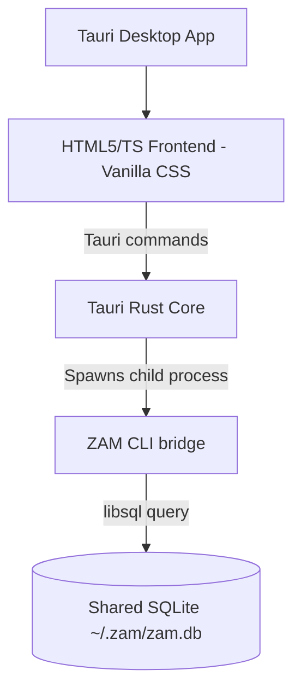

# Implementation Plan — Increment-8: ZAM Cross-Platform GUI via Tauri

This document defines the architectural blueprint and execution steps for the **ZAM cross-platform Desktop GUI application**. The GUI will run seamlessly on Windows, macOS (fully optimized for Apple Silicon M-series), and Linux.

---

## 🎯 Vision & Design Philosophy

1. **Local-First & Resource-Light**:
   - **Tauri** (Rust + Native OS Webview) will be our desktop framework, producing tiny, lightning-fast binary sizes (~10MB) and near-zero idle memory consumption.
   - Fully offline-capable, keeping the database local.
2. **Shared Database & Dual CLI-GUI Operations**:
   - Both CLI (`zam learn`) and GUI will share the exact same SQLite database file located at `~/.zam/zam.db`.
   - Your learning history, interval spacing (FSRS), and settings are completely shared and in sync, allowing you to use both seamlessly.
3. **100% DRY Architecture (Shared CLI Bridge)**:
   - We will leverage the highly modular JSON bridge (`zam bridge`) in our CLI core to query the database, pull due cards, and submit review ratings.
   - The GUI will execute the fast `zam` CLI binary in the background to access the database, eliminating the need to duplicate complex SQLite schemas, migration logic, or scheduling algorithms.
4. **Stunning Web UI Aesthetics**:
   - Dynamic dark-mode UI with glassmorphism effects, smooth micro-animations, Outfit typography, and curated warm palettes.
   - Focused, immersive active-recall screen (Question card → Reveal Answer → Rating Action) to promote study joy.

---

## 🧱 Technical Architecture

### 1. The JSON Bridge (`zam bridge`)
ZAM possesses a fully functional machine-readable JSON API built right into the command-line suite:
- `zam bridge check-due` — Checks due queue statistics (JSON)
- `zam bridge get-review` — Returns the next card review payload, including cue prompts and dynamically resolved context (JSON)
- `zam bridge submit --card-id <id> --rating <1-4>` — Logs FSRS ratings (JSON)
- `zam bridge review-action --card-id <id> --action <action>` — Handles deletes, edits, or skips.

The Tauri app will use Tauri's native `Command` API (from Rust `std::process` or Tauri shell API) to execute these commands in milliseconds and render the response on screen.

### 2. UI Layout & Glassmorphism Aesthetics
The GUI will present three main views:
1. **Overview Dashboard**:
   - Dynamic cards showing due count, learned counts, and average FSRS rating.
   - Warm-colored radial progression dials representing system and domain competencies.
2. **Recall Session Screen**:
   - An elegant, central floating card with a frosted-glass look (`backdrop-filter: blur()`).
   - Clean dynamic German translation (or user OS locale) of the English question.
   - Interactive textbox for the learner's answer.
   - An NPU evaluation loading screen showing elegant growing dots while waiting for `gemma4-it:e4b` or `phi4` to generate German praise and feedback.
   - Soft glow rating buttons (1: Again, 2: Hard, 3: Good, 4: Easy) with hotkey listeners (1, 2, 3, 4).
3. **Settings Dashboard**:
   - Toggle buttons for LLM enabling, locale selections, and model overrides (`gemma4-it:e4b`, `llama3.2:3b`, etc.) that execute `zam settings` commands under the hood.

---

## 📅 Step-by-Step Implementation Roadmap

### Step 1: Bootstrap Tauri Project Structure
1. Run `npx -y create-tauri-app@latest` in `./src-tauri` using Vite + TypeScript for the frontend wrapper.
2. Configure `tauri.conf.json` with execution permissions for the `zam` binary sidecar or path lookup.

### Step 2: The Core API Client Layer (Frontend)
1. Write `src/gui/services/bridge.ts` wrapping Tauri command invocations.
2. Interface the dynamic models matching `ReviewQueueItem` and `RecallPrompt` outputs.

### Step 3: Immersive Glassmorphism UI (HTML/Vanilla CSS)
1. Set up `index.css` defining the root variables (curated slate/neon colors, Outfit fonts, transition tokens).
2. Build the immersive floating review card container using custom HSL blur shadows.
3. Add subtle animations (keyframe scales on answer reveal, fade-ins).

### Step 4: Local NPU Generating State Visualizer
1. Build a beautiful CSS loading spinner or bouncing dot indicator to show LLM processing.
2. Wire up the 20-second dynamic retry prompt dynamically in the UI to ask the user if they want to keep waiting or proceed offline.

### Step 5: Native Shell Shortcut Integration
1. Listen to keystrokes in the webview:
   - `Enter` to reveal.
   - `1`, `2`, `3`, `4` keys to submit self-ratings.
   - `Esc` to quit the learning session.
