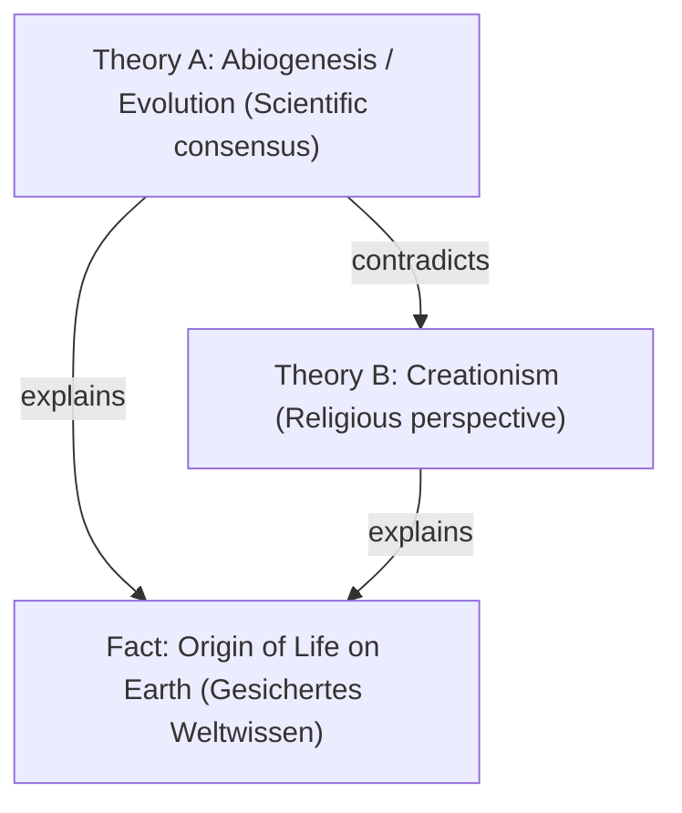

# Global Curriculum Registry & Epistemic Concept Graph (GCR)

This document outlines the architecture and definition of a central service for sharing learning concepts, curricula, and dependency graphs in ZAM.

## Context & Motivation

In ZAM, learning is driven by a local-first SQLite database holding **Tokens** (concepts) and **Cards** (user-specific FSRS review scheduling). 
Currently, users must discover or generate their own concept graphs. For K-12 school curricula (e.g., Bavarian *LehrplanPLUS*), university modules, or standard professional certs, this leads to:
1. **Redundancy:** Thousands of users requesting the same concepts from LLMs, incurring costs and API load.
2. **Quality Variance:** LLMs generating inconsistent or incorrect prerequisite structures (DAGs) for established knowledge.
3. **Onboarding Friction:** Users must manually curate what they need to know instead of importing a pre-existing path.

The **Global Curriculum Registry (GCR)** acts as a central index and semantic network of peer-reviewed concepts, allowing users to import high-quality, pre-structured learning paths directly into their local ZAM instance.

---

## Core Architecture

The GCR is built as a **hybrid central/local system** following a Registry design (similar to npm or crates.io, but for semantic knowledge graphs):

```
┌────────────────────────────────────────────────────────┐
│             Global Curriculum Registry (GCR)           │
│                                                        │
│   ┌────────────────────────────────────────────────┐   │
│   │           Canonical Concept Graph              │   │
│   │  (Semantic DAG of Tokens, Prereqs, Relations)  │   │
│   └───────────────────────┬────────────────────────┘   │
│                           ▼                            │
│   ┌────────────────────────────────────────────────┐   │
│   │            Curriculum & Tag Indexes            │   │
│   │   (Bavarian Realschule, LMU CS 101, etc.)      │   │
│   └────────────────────────────────────────────────┘   │
└───────────────────────────┬────────────────────────────┘
                            │ Download Package
                            ▼
┌────────────────────────────────────────────────────────┐
│             Local ZAM Client Instance                  │
│                                                        │
│  - Imports immutable registry tokens as references     │
│  - Creates local 'cards' pointing to GCR tokens        │
│  - Runs local parser (NPUs/LLMs) for textbooks         │
│  - Synthesizes local session data                      │
└────────────────────────────────────────────────────────┘
```

### 1. The Canonical Concept Graph
Instead of isolating school curricula into separate databases, the GCR maintains a **single, global, multi-layered concept graph**. 
* A mathematical concept like the *Satz des Pythagoras* exists exactly **once** in the global graph.
* Regional curricula (e.g., Bavaria Realschule Grade 8 Mathematics) are defined as **Filters / Views** (sub-graphs) over the canonical graph, implemented via metadata tags.
* This ensures that if a student transitions from a Bavarian Realschule to a Baden-Württemberg Gymnasium, ZAM knows exactly which concepts are already learned and which prerequisites are missing.

### 2. Epistemic Modeling & Contradictory Theories
To support pluralistic viewpoints and prevent bias while maintaining high factual integrity, the graph distinguishes between **Facts (Phenomena)** and **Explanations (Theories)**.



#### Epistemic Categories
To qualify knowledge, every Token in the GCR has an `epistemic_status` attribute:

1. **Gesichertes Weltwissen (Consolidated World Knowledge - 95%+ Consensus):**
   * Concepts representing undisputed facts or the *widely recognized existence* of theories.
   * *Example:* It is undisputed that both "Evolutionary Theory" and "Creationism" exist as explanations for life. The fact that these models exist is consolidated world knowledge.
2. **Theorie / Lehrmeinung (Theoretical/Contextual Perspective):**
   * Models that explain facts but depend on specific doctrines, scientific consensus, or religious beliefs.
   * Linked to facts via an `explains` edge and to competing theories via a `contradicts` edge.
   * Filtered/activated based on the user's educational path (e.g., Biology class vs. Religious studies).
3. **Beobachtungen & Spekulation (Observations & Fringe/Conspiracy Theories):**
   * Unverified, speculative, or scientifically refuted claims.
   * These are flagged with an `observational` tag. They do not enter the standard educational graph unless explicitly enabled by the user or flagged in an observation context (e.g., studying media literacy).

---

## Data Model Extensions

To integrate the GCR, the ZAM Core schema (see [ARCHITECTURE.md](file:///c:/src/zam/docs/ARCHITECTURE.md#L65-L78)) is extended with namespacing, epistemic tags, and remote tracking:

### 1. `tokens` Table Extensions
* `registry_id`: `TEXT NULL` (Reference to the GCR UUID; if null, the token is purely local).
* `epistemic_status`: `TEXT` (Values: `consolidated`, `perspective`, `speculative`, `observational`).
* `namespace`: `TEXT` (e.g., `math.geometry`, `history.modern`).

### 2. `token_relations` (formerly `prerequisites`)
Extends the simple prerequisite structure to support semantic connections:
* `source_token_id` -> `target_token_id`
* `relation_type`: `TEXT` (Values: `requires` (prerequisite), `explains`, `contradicts`, `subconcept_of`).

### 3. `registry_packages` (New Table)
Tracks imported curriculum paths:
* `id`: `ULID`
* `name`: `TEXT` (e.g., `de.by.realschule.k8.math`)
* `version`: `TEXT`
* `filter_query`: `TEXT` (JSON query used to extract the sub-graph of tokens from the GCR).

---

## Workflow & Integration

### A. Onboarding & Curriculum Adoption
1. **Profile Selection:** Onboarding asks: *Country -> Region -> School Type -> Grade* (e.g., *Germany -> Bavaria -> Realschule -> Grade 8*).
2. **Package Pull:** ZAM calls `zam registry pull de.by.realschule.k8`.
3. **Card Instantiation:** The local agent registers the tokens and creates FSRS `cards` for the entry-level tokens. Prerequisite blocking (see [ARCHITECTURE.md](file:///c:/src/zam/docs/ARCHITECTURE.md#L172-L188)) ensures advanced concepts remain blocked until baseline concepts are mastered.

### B. University Lectures & Textbook Imports
1. **Local Audio/PDF Processing:** The user records a lecture or imports a textbook chapter.
2. **Local Token Extraction:** The local ZAM agent (running on the user's NPU/local LLM) extracts concepts, definitions, and proposed cards.
3. **Alignment & Tagging:** The agent queries the GCR:
   * "Does a token for *Polymorphism in OOP* already exist?"
   * **Yes:** The local agent links the lecture's cards to the existing GCR token. It adds a local tag like `uni.lmu.cs101.prof-x.slide-12`.
   * **No:** The agent creates a local token.
4. **Upstream Contribution:** If the concept is globally relevant, the user can submit a PR-style proposal to merge their new token and prerequisites into the GCR.

### C. Collaborative Wiki Curation
* The GCR database is stored as structured files (e.g., YAML/JSON-LD) in a git repository or a decentralized DB.
* Educators and developers can propose additions, correct prerequisites, or flag outdated theories using Git workflows (Pull Requests).
* Educational publishers or schools can sign their packages cryptographically to guarantee authenticity.

---

## Research: Alternatives & Existing Standards

Before building from scratch, ZAM can leverage or align with several existing initiatives:

### 1. CASE (Competency and Academic Standards Exchange)
* **What it is:** A standard developed by 1EdTech (formerly IMS Global) for representing competency frameworks, educational standards, and academic rubrics digitally.
* **Why it matters:** Many US state education departments and international bodies publish curricula in CASE format.
* **ZAM Alignment:** We should design our import layer to parse CASE JSON-LD documents. This allows automatic bootstrapping of official curricula without manual transcription.

### 2. Wikidata
* **What it is:** A free, collaborative, multilingual secondary database, storing structured data for Wikipedia.
* **Why it matters:** Wikidata already contains massive semantic relationships between academic disciplines, mathematical formulas, and historical events. It handles contradictory claims using *Statements, Qualifiers, and References*.
* **ZAM Alignment:** We can use Wikidata IDs (`Q-numbers`) as canonical references inside our GCR tokens. This gives us instant access to translations, descriptions, and Wikipedia source links globally.

### 3. Serlo.org
* **What it is:** A German open-source platform ("Wikipedia for learning") that offers structured explanations, exercises, and courses aligned directly with German school curricula.
* **Why it matters:** Serlo has already mapped out most of the German school math, biology, and chemistry topics.
* **ZAM Alignment:** We can collaborate or write scrapers to import Serlo's taxonomy directly into the GCR, mapping their articles to ZAM tokens and using them as `source_links` for Active Recall cards.

### 4. Open Educational Resources (OER) Metadata
* Standards like **LOM (Learning Object Metadata)** and **Schema.org/LRMI (Learning Resource Metadata Initiative)** define how to tag learning materials. ZAM should support LRMI tags to map external learning videos (e.g., Khan Academy) to GCR tokens.

---

## Open Decisions for Discussion

1. **Verification of AI-generated inputs:** How do we filter out low-quality AI token proposals when users try to upstream their local lecture notes? (e.g., automated linter checks, community consensus upvotes, or mandatory educator review?)
2. **Licensing of Central Content:** Should the GCR be licensed under Creative Commons (CC-BY-SA) or Public Domain (CC0) to prevent proprietary lock-in?
3. **FSRS-5 Weight Tuning per Curriculum:** Should different registry packages bundle their own FSRS-5 default weights (e.g., languages might decay faster than conceptual mathematics)?
