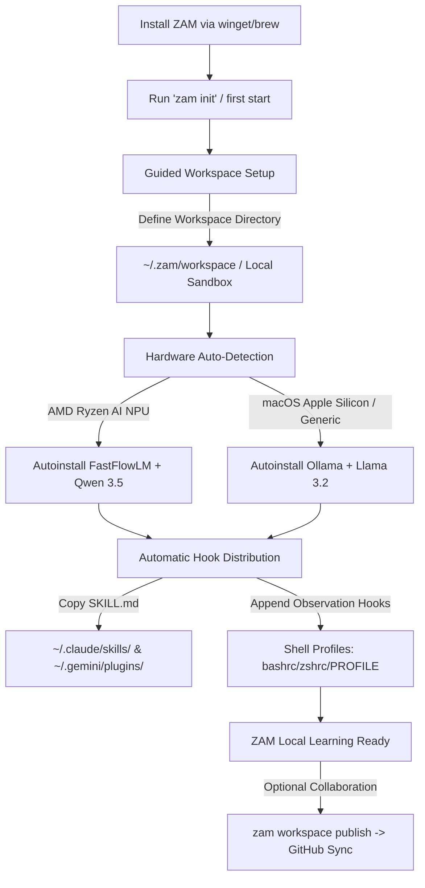

# Vision for Increment-6: Seamless Onboarding & Multi-Platform Installation Harness

## Why this is the right next increment

Increment-5 established the standalone learning session harness (`zam learn`) with local LLM question pre-generation and database backfilling. ZAM is now a highly capable learning tool, but it remains a "developer prototype." Setting it up requires deep terminal knowledge, multiple active Git repositories, manual shell hooking, and complex local LLM configuration.

To reach mainstream adoption, ZAM must transition into a product. **Increment-6** solves the onboarding friction entirely. It packages ZAM into standard operating system package managers (`winget` and `Homebrew`), introduces a hardware-detecting guided bootstrap, automates agent hook distribution, and enables a "Local Sandbox" onboarding flow that seamlessly scales to cloud collaboration via GitHub when the user is ready.

---

## Onboarding Architecture

---

## Core Components

### 1. Package Manager Deployment (`winget` & `Homebrew`)
- **Windows Deployment (`winget install zam-os`)**:
  - Package `zam-core` into a single standalone binary using Node bundlers/compilers (such as Bun, PKG, or a single executable tsup bundle wrapped with a Node runner).
  - Register ZAM on the community `winget-pkgs` repository.
  - Bundles all core capabilities, excluding the need to clone a separate `zam-core` source directory.
- **macOS Deployment (`brew install zam-os/tap/zam`)**:
  - Maintain a Homebrew tap with a simple formula.

### 2. Guided "Local Sandbox" Workspace Bootstrap
- **Zero-Friction Initial State**:
  - The first start of ZAM (or running `zam init`) prompts the user to select an active workspace directory (default: `~/.zam/workspace` or `~/Documents/zam`).
  - ZAM automatically bootstraps this directory as a **Local Sandbox** (corresponds to `zam-personal`). It populates the local folder with default worldviews and goals:
    - `beliefs/worldview.md` — Initial personal worldview.
    - `goals/goals.md` — Default personal goals.
    - `skills/` — Custom skill overrides.
  - Generates a local SQLite database at `~/.zam/zam.db`. No Git, Turso, or GitHub accounts are required for this phase.
- **Transition to Shared Collaboration (`zam workspace publish`)**:
  - When the user is ready to collaborate or back up their database:
    - ZAM walks them through connecting a GitHub account.
    - It initializes a local Git repo, creates a private/public GitHub repository (e.g. `github.com/username/zam-personal`), pushes the local workspace, and updates `.zam/config.yaml` to track the remote.
    - Collaborative workspaces (e.g., `zam-dev`, `zam-community`) are linked as remote siblings. Changes to goals and policies are gated via **GitHub Pull Requests** for strict change management, utilizing GitHub's free infrastructure.

### 3. Hardware Auto-Detection & LLM Auto-Setup
- **NPU/GPU/CPU Profiler**:
  - **Windows (Ryzen AI Detection)**: Executed via a registry check or WMI query (`Get-CimInstance Win32_VideoController` or custom PNP device checks for AMD NPU IP).
  - **macOS (Apple Silicon Detection)**: Checks CPU brand string (`sysctl -n machdep.cpu.brand_string`) to confirm Apple Silicon (M1/M2/M3/M4).
- **Automated Runner Installation**:
  - **Ryzen AI**: Recommend **FastFlowLM** (flm) + **Foundry**. ZAM launches the winget installer (`winget install -e --id FastFlowLM` or similar) and triggers a background pulling of the optimized `qwen3.5:4b` model.
  - **macOS / Generic**: Recommend **Ollama**. ZAM launches the Homebrew installer (`brew install --cask ollama`) or winget equivalent, and starts pulling the standard `llama3.2:3b` model.
  - Automatically writes the local connection settings (`llm.enabled = true`, `llm.url`, `llm.model`) to the database.

### 4. Automatic Hook & Skill Distribution
- **Agent Skill Sync**:
  - Scans user directories to detect active AI developer agents:
    - Claude Code: `~/.claude/skills/`
    - Gemini CLI / agy: `~/.gemini/skills/`
    - Goose: `~/.config/goose/`
  - Automatically copies the optimized `SKILL.md` (active-recall training recipe) into their skill directory.
- **Shell Observation Hooks**:
  - Detects the active user shell (`pwsh`, `zsh`, `bash`).
  - Appends the hook script loading commands (equivalent to `zam monitor start`) directly to user profiles (`$PROFILE`, `.zshrc`, `.bashrc`) so that command observation operates in their normal terminal windows out-of-the-box.

---

## Implementation Path

### Phase 1: Hardware Detection & Autoinstall Scripts
- Write the kernel profiler (`src/kernel/system/profiler.ts`) to query OS architecture, registry keys, and WMI for AMD NPU / Apple Silicon.
- Implement the installation command runner (`src/kernel/system/installer.ts`) to call `winget` or `brew` as child processes.

### Phase 2: Init Wizard CLI Command
- Implement `zam init` as an interactive, gorgeous CLI wizard using `@inquirer/prompts`.
- Wizard Flow:
  1. Welcome screen & workspace path configuration.
  2. Hardware detection & recommendation (FastFlowLM vs. Ollama).
  3. LLM Runner automated installation & model pull.
  4. Automatic distribution of `SKILL.md` to active agent directories.
  5. Shell hook injection into profile files.

### Phase 3: Workspace Publishing Command
- Implement `zam workspace publish` to initialize git, link a new GitHub repository, and push local workspace configs.
- Support configuring team-based Change Management (PR templates, target branches).

### Phase 4: Package Compilation & Release
- Create the winget/brew packaging scripts.
- Publish the installation manifests to the respective package manager registries.
